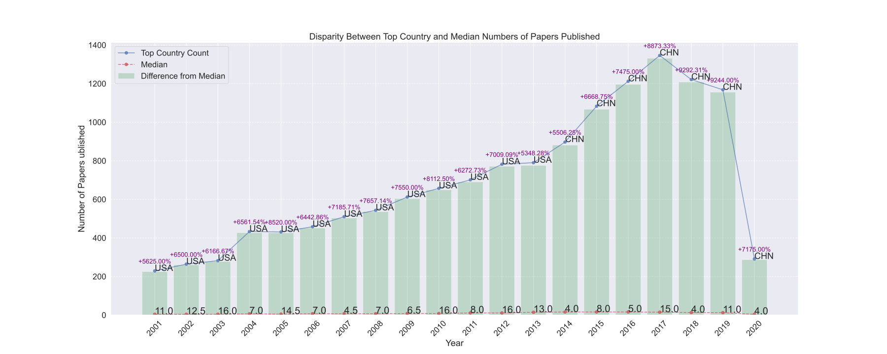
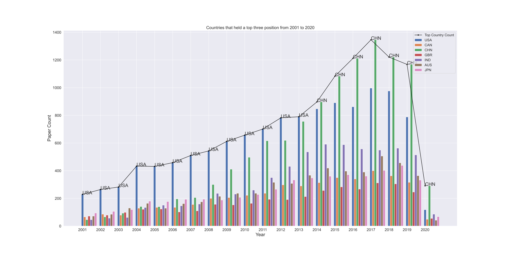
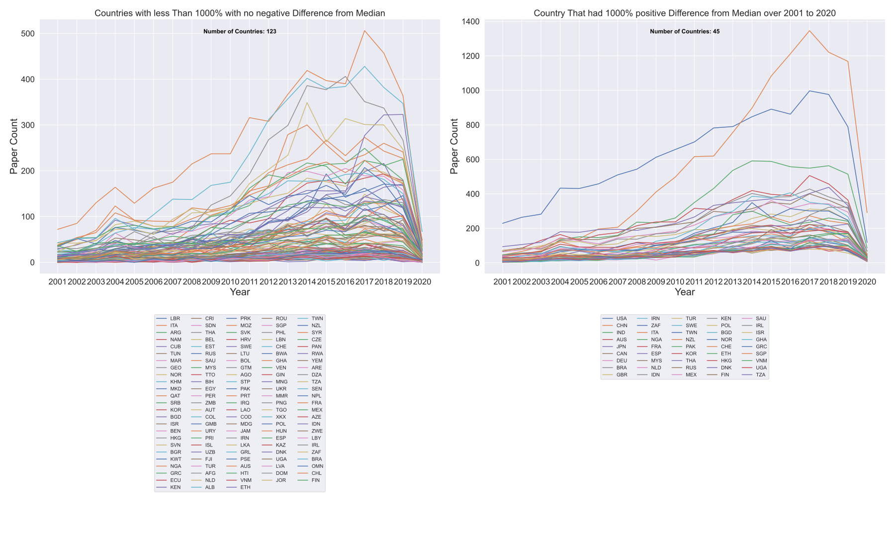
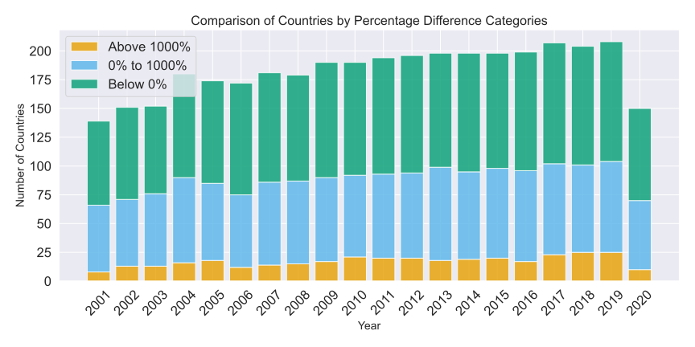
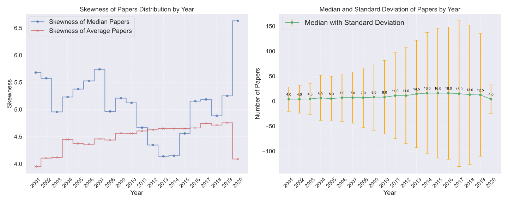

---
author:
- Abey Richard Hurtis
bibliography:
- ref.bib
date: 2024-10-16
title: Project Discription
---

# Project Setup 
Clone the project : ```git clone https://github.com/Abey12525/METAEXPLORE.git```  

---
Download the following datasets into project directory 
  
Dataset : results_completed.csv(rename the dataset from results_completed_updated_20231003.csv to results_completed.csv ) [https://datacatalogfiles.worldbank.org/ddh-published/0065200/DR0092801/results_completed_updated_20231003.csv?versionId=2024-05-13T14:24:55.8520476Z]    

data_use_country_scores_annual.csv [https://datacatalogfiles.worldbank.org/ddh-published/0065200/DR0092803/data_use_country_scores_annual.csv?versionId=2024-05-13T14:25:01.7623013Z]  

---

Install required libraries : 
```pip install requirements.txt```
  
---  

# Running the project 
you can open the stats.ipynb Jupyter notebook   
or   
you can run the following comman for a non interactive result : ```python stats.py```  

**project developed on Python 3.11.4**
---

[!NOTE]  
The data used in this project is derived from a restricted subset of the Semantic Scholar Open Research Corpus (S2ORC). From an original dataset of over 130 million papers, multiple filters were applied to focus on relevant articles:  

- Only papers with abstracts and parsable PDFs/LaTeX files (2000–2020) were included.  
- Fields like Economics, Medicine, and Sociology were prioritized, excluding others like Biology and Physics.  
- A random convenience sample of ~1 million articles was used due to computational limits.  

These restrictions mean the dataset does not comprehensively represent global academic research. Additionally, the Natural Language Processing (NLP) methods used for classification may introduce biases or errors. Interpret results with caution.  


---
# Introduction

The **Data Use in Academia Dataset** is a subset of the Semantic Scholar
Open Research Corpus (S2ORC) [@DataUseinAcademiaDataset] [@lo2020],
comprising over 130 million English-language academic papers across
multiple disciplines, sourced from publishers, open archives like arXiv
and PubMed, and web crawls. To enhance usability and relevance,
restrictions were applied: only articles with an abstract and a parsed
PDF or LaTeX file were included, resulting in approximately 30 million
articles. Additionally, only articles published between 2000 and 2020
were considered. Articles from fields less likely to utilize data from
national statistical systems, such as Biology and Engineering, were
excluded, narrowing the dataset to around 10 million articles. Natural
Language Processing (NLP) techniques were employed to extract the
countries of study and data usage from the text, utilizing two main
approaches: regular expression searches based on ISO3166 country names
and Named Entity Recognition (NER) via the spaCy library.


## Analysis

### Observing the top Journal and amount of papers published. 


# China's Research Boom and the COVID-19 Disruption

The dataset providees an interesting look at the global distribution of research output over a span of nearly two decades.



|    |   Year | Top Country   |   Top Country Count |   Median |   Difference from Median |   Percentage Difference |
|---:|-------:|:--------------|--------------------:|---------:|-------------------------:|------------------------:|
| 11 |   2001 | USA           |                 229 |      4   |                    225   |                 5625    |
| 18 |   2002 | USA           |                 264 |      4   |                    260   |                 6500    |
| 15 |   2003 | USA           |                 282 |      4.5 |                    277.5 |                 6166.67 |
|  6 |   2004 | USA           |                 433 |      6.5 |                    426.5 |                 6561.54 |
| 12 |   2005 | USA           |                 431 |      5   |                    426   |                 8520    |
|  7 |   2006 | USA           |                 458 |      7   |                    451   |                 6442.86 |
|  2 |   2007 | USA           |                 510 |      7   |                    503   |                 7185.71 |
|  5 |   2008 | USA           |                 543 |      7   |                    536   |                 7657.14 |
|  3 |   2009 | USA           |                 612 |      8   |                    604   |                 7550    |
| 14 |   2010 | USA           |                 657 |      8   |                    649   |                 8112.5  |
|  8 |   2011 | USA           |                 701 |     11   |                    690   |                 6272.73 |
| 13 |   2012 | USA           |                 782 |     11   |                    771   |                 7009.09 |
| 17 |   2013 | USA           |                 790 |     14.5 |                    775.5 |                 5348.28 |
|  0 |   2014 | CHN           |                 897 |     16   |                    881   |                 5506.25 |
|  9 |   2015 | CHN           |                1083 |     16   |                   1067   |                 6668.75 |
|  4 |   2016 | CHN           |                1212 |     16   |                   1196   |                 7475    |
| 16 |   2017 | CHN           |                1346 |     15   |                   1331   |                 8873.33 |
|  1 |   2018 | CHN           |                1221 |     13   |                   1208   |                 9292.31 |
| 10 |   2019 | CHN           |                1168 |     12.5 |                   1155.5 |                 9244    |
| 19 |   2020 | CHN           |                 291 |      4   |                    287   |                 7175    |

### China's Rise to Dominance (Post-2014)

- **From 2001 to 2013**, the United States consistently published more research papers than any other country, peaking at 790 papers in 2013. During this period, the difference in output between U.S. and other countries remained substantial, with the U.S. having the heighest counts year after year. 

- **2014 - The Shift**: In 2014, China overtakes the U.S. for the first time, with 897 papers publised compared to the U.S. . This markks the beginning of a clear shift in global research dominance. The differeence between the U.S. and China continues to grow in the following years. 

- **2015-2020: China's Contined Growth**: By 2015, China's output rises sharply to 1083 papers, overtaking the U.S. . The Gap widens further in 2016 (1,212 papers), 2017 (1,346 papers), and peaks in 2018 with 1,221 papers. The rapid growth in Chaina's research output highlights a clear thrend: China has increasingly become a global research leader, with signigicant investments in science and technology, a investments in science and technology, a growing research community, and a focus on higher education and innovation. 

- **China's Reseach Growth**: China's percentage difference from the median (Percentage increase from the median) has consistently been high, especially post-2014. this indicates thath China has not only produceed more papers but has incresingly outpaced the global median, with a higher concentration of research output compared to other nations. 

### **Imapct of COVID-19(2020)**

- **2020: A Drastic Decline**: The year 2020 standsd out as an anomaly. while the dataset shows China as still having the higheest count (291 papers), there is a dramatic drop in the total numbers of published papers from 2019 (1168 papers). This suggests a significant impact from the COVID-19 pandamic, which disrupted the global research ecosystem. Travel restrictions, lab clousers, and social distancing measures likely hindered researchers ability to conduct experiments, collaborate internationally, and publish their findings. 

- **Percentage Drop**: The percentage difference from the mediann for China drops dramatically in 2020, reflecting a sharp deviation from the prior years' trends. This sharp decrease may be reflective of the broader global slowdown in academic and research activities, as institutions and researchers worldwide adjusted to realities of the pandemic. 

- **Global Imapct**: The decline in research output in 2020 is not unique to China but is evident accross many countries. The world saw a shift in priorites as pandemic became the new norm. However, the magnitude of the decreasee in publishedd papers underscores the fragility of research prductivity in an unexpected global crises. 

### **Other Interesting Insights** 
- **Median Values**: The median numbers of papers published fluctuates across the yearrs, reflecting shifts in global research output. The median starts at alower value in earlier years but gradually increases as the overall research ouput grows globally. 
   
# sensitivity 



|      |   Above 1000% |   0% to 1000% |   Below 0% |
|-----:|--------------:|--------------:|-----------:|
| 2001 |             8 |            58 |         62 |
| 2002 |            13 |            58 |         71 |
| 2003 |            13 |            63 |         76 |
| 2004 |            16 |            74 |         90 |
| 2005 |            18 |            67 |         77 |
| 2006 |            12 |            63 |         83 |
| 2007 |            14 |            72 |         88 |
| 2008 |            15 |            72 |         84 |
| 2009 |            17 |            73 |         94 |
| 2010 |            21 |            71 |         91 |
| 2011 |            20 |            73 |         95 |
| 2012 |            20 |            74 |         95 |
| 2013 |            18 |            81 |         99 |
| 2014 |            19 |            76 |         95 |
| 2015 |            20 |            78 |         97 |
| 2016 |            17 |            79 |         96 |
| 2017 |            23 |            79 |        103 |
| 2018 |            25 |            76 |         97 |
| 2019 |            25 |            79 |        104 |
| 2020 |            10 |            60 |         66 |

# Income level and Research Output


**Postive 1000 percent difference from Median**

|    | Income Level        | Region                     |   Count |
|---:|:--------------------|:---------------------------|--------:|
|  0 | High income         | East Asia & Pacific        |   13800 |
|  1 | High income         | Europe & Central Asia      |   17963 |
|  2 | High income         | Middle East & North Africa |     139 |
|  3 | High income         | North America              |   16542 |
|  4 | Low income          | Sub-Saharan Africa         |     335 |
|  5 | Lower middle income | Middle East & North Africa |    3203 |
|  6 | Lower middle income | South Asia                 |    6586 |
|  7 | Lower middle income | Sub-Saharan Africa         |    2334 |
|  8 | Upper middle income | East Asia & Pacific        |   13928 |
|  9 | Upper middle income | Europe & Central Asia      |    1898 |
| 10 | Upper middle income | Latin America & Caribbean  |    4292 |
| 11 | Upper middle income | Sub-Saharan Africa         |    2955 |

 **Greater than 0 and 1000 percent difference from Median**

|    | Income Level        | Region                     |   Count |
|---:|:--------------------|:---------------------------|--------:|
|  0 | High income         | East Asia & Pacific        |    4547 |
|  1 | High income         | Europe & Central Asia      |   15816 |
|  2 | High income         | Latin America & Caribbean  |     853 |
|  3 | High income         | Middle East & North Africa |    2400 |
|  4 | Low income          | East Asia & Pacific        |      17 |
|  5 | Low income          | Middle East & North Africa |     182 |
|  6 | Low income          | South Asia                 |     368 |
|  7 | Low income          | Sub-Saharan Africa         |    2713 |
|  8 | Lower middle income | East Asia & Pacific        |    2402 |
|  9 | Lower middle income | Europe & Central Asia      |     468 |
| 10 | Lower middle income | Latin America & Caribbean  |     252 |
| 11 | Lower middle income | Middle East & North Africa |    2331 |
| 12 | Lower middle income | South Asia                 |    3928 |
| 13 | Lower middle income | Sub-Saharan Africa         |    4643 |
| 14 | nan                 | Latin America & Caribbean  |     100 |
| 15 | Upper middle income | East Asia & Pacific        |    3017 |
| 16 | Upper middle income | Europe & Central Asia      |    3181 |
| 17 | Upper middle income | Latin America & Caribbean  |    4473 |
| 18 | Upper middle income | Middle East & North Africa |     822 |
| 19 | Upper middle income | Sub-Saharan Africa         |     343 |

**Below 0 percent difference from Median**

|    | Income Level        | Region                     |   Count |
|---:|:--------------------|:---------------------------|--------:|
|  0 | High income         | East Asia & Pacific        |     212 |
|  1 | High income         | Europe & Central Asia      |     486 |
|  2 | High income         | Latin America & Caribbean  |     653 |
|  3 | High income         | Middle East & North Africa |     389 |
|  4 | High income         | North America              |       9 |
|  5 | High income         | Sub-Saharan Africa         |      34 |
|  6 | Low income          | East Asia & Pacific        |      91 |
|  7 | Low income          | Middle East & North Africa |     144 |
|  8 | Low income          | South Asia                 |       2 |
|  9 | Low income          | Sub-Saharan Africa         |     893 |
| 10 | Lower middle income | East Asia & Pacific        |     394 |
| 11 | Lower middle income | Europe & Central Asia      |     143 |
| 12 | Lower middle income | Latin America & Caribbean  |     271 |
| 13 | Lower middle income | Middle East & North Africa |     154 |
| 14 | Lower middle income | South Asia                 |      65 |
| 15 | Lower middle income | Sub-Saharan Africa         |     608 |
| 16 | nan                 | Latin America & Caribbean  |      67 |
| 17 | Upper middle income | East Asia & Pacific        |     153 |
| 18 | Upper middle income | Europe & Central Asia      |     712 |
| 19 | Upper middle income | Latin America & Caribbean  |     493 |
| 20 | Upper middle income | Middle East & North Africa |      84 |
| 21 | Upper middle income | South Asia                 |      25 |
| 22 | Upper middle income | Sub-Saharan Africa         |     212 |

### **Overview of the Bubble Chart Distribution**  
The bubble chart provides a clear representation of research output across different income levels and regions. The x-axis orders income levels from low to high, while the y-axis captures the number of published papers. Bubble sizes correspond to the magnitude of publications, making it easy to compare regional research activity at each income level. The visualization highlights both expected patterns, such as the dominance of high-income regions, and unexpected trends, such as the variability within each income group.

### **Research Output in High-Income Regions**  
The "Positive 1000 Percent Difference from Median" chart prominently features high-income regions like Europe & Central Asia and North America with the largest bubbles, indicating their leading positions in global research output. Europe & Central Asia, in particular, stands out with an impressive 17,963 papers, positioned at the upper end of the y-axis. However, within high-income regions, there are surprising data points, such as the **Middle East & North Africa**, which shows a significantly smaller bubble with just 139 papers. This contrast illustrates that while wealth enables higher research productivity, other factors such as research funding, policies, and political stability play crucial roles.

### **Lower and Middle-Income Regions: Emerging Contributions**  
 South Asia, in particular, displays a sizable bubble, representing 3,928 papers, reflecting significant progress in academic output despite economic constraints. Similarly, Sub-Saharan Africa, with contributions from both low-income and lower-middle-income categories, demonstrates growth in research. These findings suggest that some regions are building robust academic frameworks.

### **Challenges in Low-Income Regions**
low-income South Asia shows the smallest bubble with just 2 papers, emphasizing the significant challenges faced by underdeveloped regions in contributing to global research. This is mirrored in other low-income regions, such as Sub-Saharan Africa, which produces relatively modest outputs. Even within high-income areas, there are outliers, such as North America’s unexpectedly small bubble of 9 papers in this category.



### **Median Skewness:**
The skewness for the **median** values of the number of papers published by each country varies from around **4.14** to **6.63** across the years. This indicates a **positive skewness**, meaning that the distribution of the number of papers published by countries is **right-skewed** in most years.

In simple terms, a **positive skew means that in most years, a small number of countries are publishing a disproportionately large number of papers** compared to the majority of countries. The larger the skewness value, the more pronounced this effect is, with a few countries contributing a significant proportion of total scientific publications.

#### **Key Observations:**
- **High Skewness in 2020 (6.63)**: The year 2020 exhibits the highest skewness, suggesting that a very small number of countries (perhaps due to the pandemic or other factors) contributed most of the research output. This might reflect global shifts in scientific focus or funding during that period.
- **Stable Skewness (around 5)**: Most years have skewness values clustered around **5**, indicating a similar distribution across multiple years. This pattern suggests that in general, the global scientific output has been concentrated in the hands of a few countries.

### **Average Skewness:**
The skewness for the **average** number of papers published by each country is somewhat lower, ranging from around **4.09** to **4.75**. While this is still a **positive skew**, it is less extreme compared to the skewness of the median. The skewness for the average papers published is consistently in the **4.x** range, which suggests a **more balanced distribution** but still highlights the presence of outliers in some years.

#### **Key Observations:**
- **Consistent but Lower Skewness**: The **average skewness** values are generally lower than the **median skewness**, reflecting that the calculation of the **average dampens the influence of extreme outliers**. The average can be affected by very high values, but not as much as the median, which is more resistant to extreme values.
- **Gradual Decrease in Skewness**: There is a slight decrease in skewness from **4.75** (2020) to **3.95** (2001), indicating that the **concentration of scientific output among a few countries** might have been slightly more pronounced in the later years. **The skewness decrease towards earlier years suggests a somewhat more even distribution in scientific publications.**


### **Comparing Median and Average Skewness:**
- The **median skewness** is consistently higher than the **average skewness** across almost all years. This is expected because the median, being a measure of central tendency, is more robust to extreme outliers, whereas the average can be heavily influenced by a small number of countries publishing a large number of papers.
- The larger values of skewness in the **median** data show that, even when outliers are accounted for, the global scientific community is characterized by a few dominant countries, particularly in recent years.

### **Interpretation:**
**Impact of Outliers**: The skewness of the **median** being higher than that of the **average** suggests that extreme outliers (countries with very high paper counts) have a stronger impact on the distribution when considering the median. This could indicate that a few countries dominate scientific publications in each year.

**Global Trends**: The increase in skewness values over time, particularly in the last few years (with 2020 being the highest), indicates a growing gap between countries in terms of research productivity.
##**Error Bars**:

   - The error bars (in orange) represent the standard deviation, which shows how spread out the number of papers is across countries.
   - A higher standard deviation means more variation in the number of papers published across countries for that year.
   - The standard deviation starts relatively low (\~24), increases significantly (\~130), and fluctuates in the later years, reflecting growing disparities among countries.

   - The median generally increases over time, which might suggest a global upward trend in paper production.
   - The standard deviation also grows, indicating that while some countries are contributing more papers, disparities between countries are also becoming more pronounced.


# References

##### [1.] **Data Use in Academia** Stacy, B., Kitzmüller, L., Wang, X., Mahler, D. G., & Serajuddin, U. (2023). *[Data Use in Academia](https://datacatalog.worldbank.org/search/dataset/0065200/Data-Use-in-Academia-Dataset)*. Accessed: Oct 9, 2024.

##### [2.] **S2ORC: The Semantic Scholar Open Research Corpus** Lo, K., Wang, L. L., Neumann, M., Kinney, R., & Weld, D. S. (2020). *S2ORC: The Semantic Scholar Open Research Corpus*. [arXiv:1911.02782](https://arxiv.org/abs/1911.02782).
