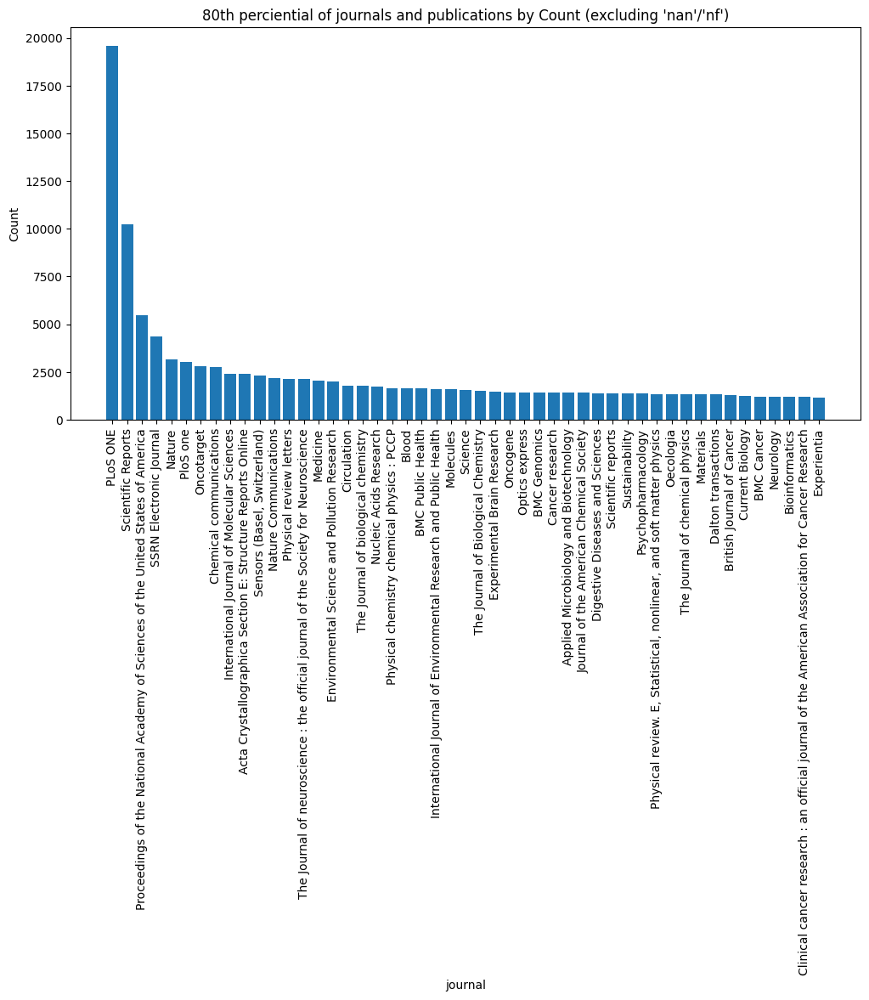
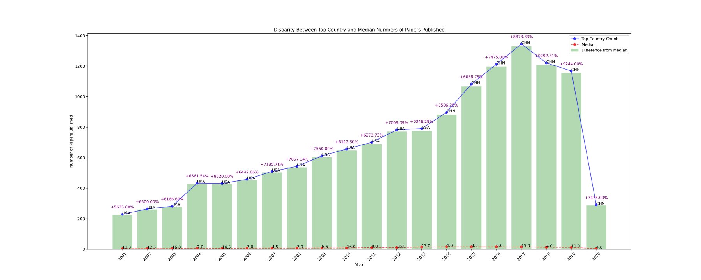

---
author:
- Abey Richard Hurtis
bibliography:
- ref.bib
date: 2024-10-16
title: Project Discription
---

# Introduction

The **Data Use in Academia Dataset** is a subset of the Semantic Scholar
Open Research Corpus (S2ORC) [@DataUseinAcademiaDataset] [@lo2020],
comprising over 130 million English-language academic papers across
multiple disciplines, sourced from publishers, open archives like arXiv
and PubMed, and web crawls. To enhance usability and relevance,
restrictions were applied: only articles with an abstract and a parsed
PDF or LaTeX file were included, resulting in approximately 30 million
articles. Additionally, only articles published between 2000 and 2020
were considered. Articles from fields less likely to utilize data from
national statistical systems, such as Biology and Engineering, were
excluded, narrowing the dataset to around 10 million articles. Natural
Language Processing (NLP) techniques were employed to extract the
countries of study and data usage from the text, utilizing two main
approaches: regular expression searches based on ISO3166 country names
and Named Entity Recognition (NER) via the spaCy library.

## Questions

-   Which countries or regions are the most frequent sources of academic
    data?

-   What are the papers with the highest outbound and inbound citations?

    -   Analyze citation distribution to identify highly influential
        works.

-   How has publication volume in various fields evolved over time?

    -   Identify fields with the most and least growth over time.

-   Are there trends in annual increases or decreases in publications?

    -   Examine year-over-year changes in publication volume.

-   Which fields of study are most represented by country?

-   Which journals or venues publish the most articles?

## Analysis

### Observing the top Journal and amount of papers published. 

# China's Research Boom and the COVID-19 Disruption

The dataset providees an interesting look at the global distribution of research output over a span of nearly two decades.

### China's Rise to Dominance (Post-2014)

- **From 2001 to 2013**, the United States consistently published more research papers than any other country, peaking at 790 papers in 2013. During this period, the difference in output between U.S. and other countries remained substantial, with the U.S. having the heighest counts year after year. 

- **2014 - The Shift**: In 2014, China overtakes the U.S. for the first time, with 897 papers publised compared to the U.S. . This markks the beginning of a clear shift in global research dominance. The differeence between the U.S. and China continues to grow in the following years. 

- **2015-2020: China's Contined Growth**: By 2015, China's output rises sharply to 1083 papers, overtaking the U.S. . The Gap widens further in 2016 (1,212 papers), 2017 (1,346 papers), and peaks in 2018 with 1,221 papers. The rapid growth in Chaina's research output highlights a clear thrend: China has increasingly become a global research leader, with signigicant investments in science and technology, a investments in science and technology, a growing research community, and a focus on higher education and innovation. 

- **China's Reseach Growth**: China's percentage difference from the median (Percentage increase from the median) has consistently been high, especially post-2014. this indicates thath China has not only produceed more papers but has incresingly outpaced the global median, with a higher concentration of research output compared to other nations. 

### **Imapct of COVID-19(2020)**

- **2020: A Drastic Decline**: The year 2020 standsd out as an anomaly. while the dataset shows China as still having the higheest count (291 papers), there is a dramatic drop in the total numbers of published papers from 2019 (1168 papers). This suggests a significant impact from the COVID-19 pandamic, which disrupted the global research ecosystem. Travel restrictions, lab clousers, and social distancing measures likely hindered researchers ability to conduct experiments, collaborate internationally, and publish their findings. 

- **Percentage Drop**: The percentage difference from the mediann for China drops dramatically in 2020, reflecting a sharp deviation from the prior years' trends. This sharp decrease may be reflective of the broader global slowdown in academic and research activities, as institutions and researchers worldwide adjusted to realities of the pandemic. 

- **Global Imapct**: The decline in research output in 2020 is not unique to China but is evident accross many countries. The world saw a shift in priorites as pandemic became the new norm. However, the magnitude of the decreasee in publishedd papers underscores the fragility of research prductivity in an unexpected global crises. 

### **Other Interesting Insights** 
- **Median Values**: The median numbers of papers published fluctuates across the yearrs, reflecting shifts in global research output. The median starts at alower value in earlier years but gradually increases as the overall research ouput grows globally. 
   
# References
